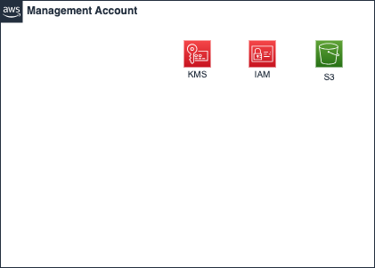

# Management Account

Management Account는 IAM 관리와 보안 로그 집중화를 담당하는 계정입니다. 이 계정은 사용자의 권한 및 계정을 중앙에서 관리하고, 보안 및 거버넌스를 강화하기 위한 역할을 수행합니다.

## Management Account의 주요 역할

1. IAM 및 액세스 관리
   - IAM 사용자 및 역할을 정의하여 관리자 또는 감사자(Auditor)와 같은 권한을 부여합니다.
   - IAM policy deny action을 사용하여 모든 계정에 일관된 보안 정책을 적용합니다.
2. 보안 로그 집중화
   - 모든 워크로드 계정에서 생성된 보안 로그(CloudTrail, Config, GuardDuty 등)를 S3 버킷에 수집합니다. 이를 통해 조직 전체의 활동을 모니터링하고 감사(Audit) 및 규정 준수를 용이하게 합니다.
3. AWS 서비스 거버넌스
   - AWS Config를 사용하여 조직 전체의 리소스 구성을 평가하고 규정을 준수하도록 관리합니다.

## Infrastructure



## Variables

```
# Generic Variables
region      = "ap-northeast-2"
service     = "test"
environment = "dev"
owners      = "user.email.com"
accounts = {
  "mgmt"    = "096090541966"
  "network" = "096090541652"
  "shared"  = "096090541481"
  "sandbox" = "096090540647"
  "dev"     = "096090541979"
  "stg"     = "096090541898"
  "prd"     = "096090542079"
}
# IAM user group Variables
create_iam                     = true
create_account_password_policy = true
account_alias                  = "test-mgmt"
iam_user_admins                = ["admin1@email.com", "admin2@email.com", "admin3@email.com"]

# KMS CMK Variables
create_kms_ebs = false
create_kms_rds = false
create_kms_enc = true
create_kms_cloudtrail = true
create_kms_guardduty = true

# S3 Buckets Variables
create_s3_cloudtrail_log = true
create_s3_config_log = true
create_s3_vpc_flow_log = true
create_s3_access_log = true
```
